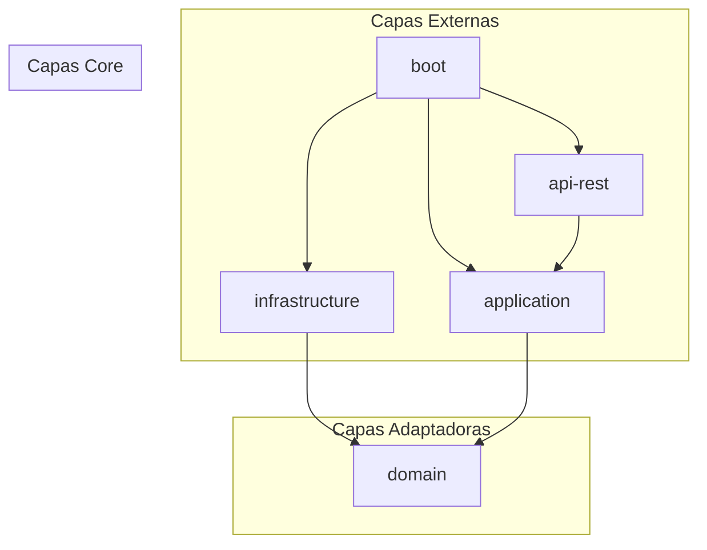

# Ciklum Search Engine

Servicio de búsqueda especializado que proporciona capacidades avanzadas de consulta sobre datos de proyectos. Utiliza **MongoDB Atlas Search** para realizar búsquedas complejas de texto completo y compuestas, como autocompletado de nombres de proyectos y filtrado por etiquetas.

## Stack Tecnológico

| Tecnología | Versión |
| :--- | :--- |
| Java | 25 |
| Spring Boot | 3.5.0 |
| MongoDB | 7.0 |
| Lombok | 1.18.36 |
| MapStruct | 1.6.3 |
| Maven | 3.9+ |
| Docker | 20.10+ |

## Arquitectura

El proyecto sigue una **Arquitectura Hexagonal** (Ports and Adapters) organizada en cinco módulos Maven:

| Módulo | Responsabilidad |
| :--- | :--- |
| `domain` | Lógica de negocio, entidades (`Project`) y puertos (interfaces de repositorio). |
| `application` | Capa de orquestación con casos de uso y formateadores de consultas. |
| `infrastructure` | Implementaciones externas: repositorios MongoDB Atlas Search. |
| `api-rest` | Punto de entrada REST: controladores, DTOs y validadores. |
| `boot` | Entrada de la aplicación Spring Boot que conecta todos los módulos. |



## Requisitos Previos

- **Java 25**
- **Maven 3.9+** (o usar el Maven Wrapper incluido)
- **Docker 20.10+**

## Inicio Rápido

### 1. Levantar la base de datos

```bash
cd mic-clkscheng/compose
docker-compose up -d
```

Esto arranca una instancia de MongoDB 7 configurada como Replica Set (`rs-localdev`).

### 2. Inicializar datos y índice de búsqueda

Una vez que el contenedor de MongoDB esté corriendo, inicializa la base de datos `Search_engine`, la colección `projects` y el índice Atlas Search `dyn_idx0` usando los scripts proporcionados:

| Script | Función |
| :--- | :--- |
| `projects-data.js` | Elimina datos existentes e inserta documentos de ejemplo. |
| `projects-indexes.js` | Configura el índice de búsqueda `dyn_idx0` en la colección `projects`. |

Los scripts se encuentran en `mic-clkscheng/code/src/test/resources/compose/mongodb/search_engine/projects/scripts/`.

### 3. Compilar el proyecto

```bash
cd mic-clkscheng
# Unix/macOS
./mvnw clean install

# Windows
.\mvnw.cmd clean install
```

### 4. Ejecutar la aplicación

Con Maven:
```bash
./mvnw -pl code/boot spring-boot:run
```

O directamente con el JAR:
```bash
java -jar code/boot/target/boot-0.0.1-SNAPSHOT.jar
```

La aplicación se levanta en el puerto **8080**.

## API

### Buscar Proyectos

```
POST /v1/projects
```

**Request Body:**

```json
{
  "name": "mi proyecto",
  "tags": ["java", "spring"]
}
```

**Response:**

```json
{
  "projects": [
    {
      "name": "Nombre del Proyecto",
      "description": "Descripción del proyecto",
      "tags": ["java", "spring"],
      "createdAt": "2024-01-01T00:00:00Z"
    }
  ]
}
```

## Estructura del Proyecto

```
mic-clkscheng/
├── compose/                  # Docker Compose para MongoDB local
│   └── docker-compose.yml
├── code/
│   ├── domain/               # Entidades y puertos del dominio
│   ├── application/          # Casos de uso y formateadores
│   ├── infrastructure/       # Adaptadores MongoDB Atlas Search
│   ├── api-rest/             # Controladores REST, DTOs, validadores
│   ├── boot/                 # Punto de entrada Spring Boot
│   ├── src/test/             # Recursos de test y scripts de seed
│   └── pom.xml               # POM padre multi-módulo
├── mvnw                      # Maven Wrapper (Unix)
└── mvnw.cmd                  # Maven Wrapper (Windows)
```

## Documentación

Para documentación detallada sobre la arquitectura, capas y componentes del proyecto, consulta la [Wiki del repositorio](../../wiki).
